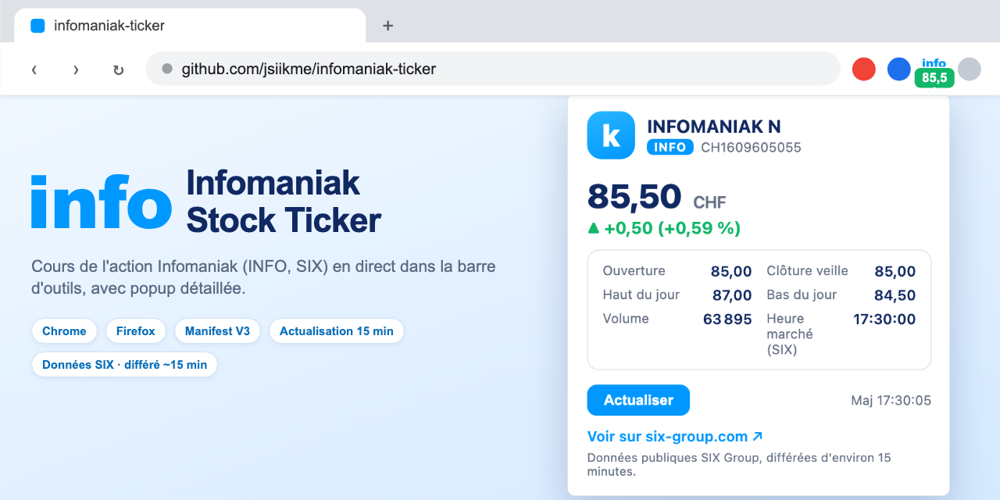

# INFO — Infomaniak Stock Ticker

Extension navigateur (Chrome + Firefox, Manifest V3) qui affiche en permanence le cours de l'action **Infomaniak** (ticker `INFO`, SIX Swiss Exchange) :

- **Icône** : logotype « info » bleu, sans fond, au-dessus du badge, badge du prix sur fond **vert** (hausse) / **rouge** (baisse)
- **Popup** : prix, variation absolue et %, ouverture, clôture veille, plus haut/bas, volume, heure de marché, lien vers la page SIX
- **Actualisation** : toutes les **5 minutes** via `chrome.alarms` (les cours restent différés d'environ 15 minutes côté SIX)
- **Données** : API publiques SIX (`fqs/movie.json` + `share_details`), sans clé — cours **différés d'environ 15 minutes**



## Avertissement

- Projet personnel, développé à titre privé. Extension non officielle : elle n'est ni éditée, ni approuvée, ni soutenue par Infomaniak ou par SIX.
- Les cours affichés proviennent de sources publiques de SIX. Ils sont différés d'environ 15 minutes et peuvent être incomplets, inexacts, interrompus ou obsolètes.
- Les informations sont fournies à titre indicatif uniquement. Elles ne constituent ni un conseil en placement, ni une recommandation, ni une offre ou une sollicitation d'achat ou de vente de valeurs mobilières.
- Aucune décision d'investissement ne doit se fonder sur cette extension. Les cours doivent être vérifiés auprès d'une source officielle (SIX, banque ou courtier).
- L'extension est fournie « en l'état », sans garantie d'aucune sorte, notamment d'exactitude, de disponibilité ou d'adéquation à un usage particulier.
- Dans la mesure permise par la loi applicable, l'auteur décline toute responsabilité pour tout dommage, direct ou indirect, résultant de l'utilisation de l'extension ou des informations affichées, ou de l'impossibilité de les utiliser.
- « Infomaniak » et « SIX » sont des marques de leurs titulaires respectifs. Elles sont mentionnées uniquement pour identifier le titre affiché.

## Installation

### Chrome / Edge / Brave

1. Ouvrir `chrome://extensions`
2. Activer le **mode développeur**
3. « Charger l'extension non empaquetée » → sélectionner le dossier `chrome/`

### Firefox

1. Ouvrir `about:debugging#/runtime/this-firefox`
2. « Charger un module complémentaire temporaire » → sélectionner `firefox/manifest.json`

> Firefox recharge l'extension à chaque redémarrage du navigateur (module temporaire).

## Structure

```
chrome/     variante Chrome (service worker MV3)
firefox/    variante Firefox (event page MV3, min. Firefox 115)
lib/        logique partagée (parsing FQS, formats fr-CH, tendance)
popup/      popup (cours détaillé + actualisation manuelle)
tools/      tests (node tools/test-quote.mjs) et génération d'icônes
fixtures/   réponse FQS d'exemple pour les tests
```

## Tests

```bash
node tools/test-quote.mjs
```

## Notes

- Les variantes `chrome/` et `firefox/` sont volontairement autonomes (chargement direct sans étape de build).
